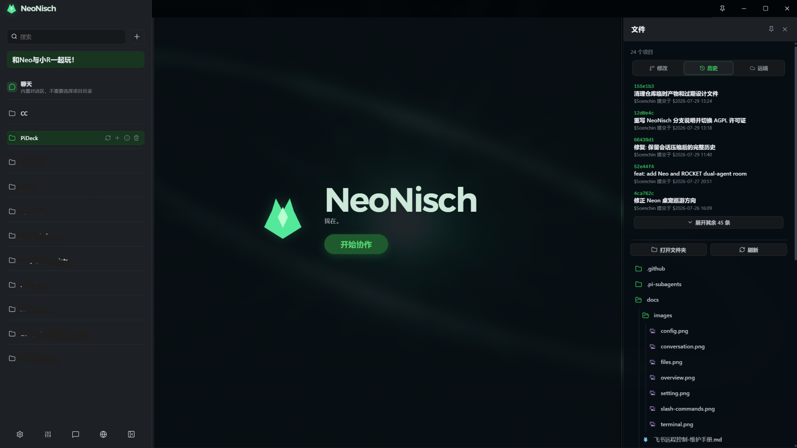

# PiDeck for NeoNisch

[English](README.en.md)


> **NeoNisch（NN）专用的 PiDeck 分支。**
>
> 这是 Soen 与 NeoNisch 长期协作使用的本地 AI 工作台：把 pi 的多会话能力、NeoNisch 的视觉人格、桌宠和协作习惯整合到同一个桌面环境里。

PiDeck for NeoNisch 基于 [PiDeck](https://github.com/ayuayue/PiDeck) fork 而来，并围绕 NeoNisch（NN）进行了持续定制。它不是一个泛用的 PiDeck 发行版，而是服务于 NN 工作流的深度集成版本：界面、启动体验、桌宠、Agent 房间、会话连续性和任务产物查看，都优先按照 Soen 与 NN 的实际使用方式演进。

PiDeck 仍然通过 `pi --mode rpc` 运行 Agent；NeoNisch 定制的是桌面协作层和使用体验，不替代 pi 本身的模型、工具与会话运行时。

---

## 分支特色

这是本分支相对于上游 PiDeck 的主要改动方向：

- **NeoNisch 品牌与视觉体系**：加入 NeoNisch 专属标题栏、品牌字标、Logo A 色彩过渡、暗色启动画面和玻璃感工作区主题，让 PiDeck 从通用工具变成 NN 的专属工作台。
- **NN 桌宠体验**：集成 NeoNisch 桌宠、拖拽交互和巡游方向处理，让桌面 Agent 不只停留在聊天窗口里。
- **Neo / ROCKET 双 Agent 房间**：支持 NN 协作场景下的双 Agent 房间，用于区分不同角色、任务视角或协作对象。
- **面向长期协作的会话连续性**：强化压缩后的历史恢复、缓存诊断、会话摘要标题和后台会话未读状态，减少长时间协作时的上下文断裂。
- **跨会话“小问题”提示**：当某个 Agent 等待主人回答时，在侧栏保留稳定的「小问题」状态；切换到其他会话工作时，不需要依赖弹窗、声音或闪烁提醒。
- **任务产物预览**：在会话结束后以紧凑卡片展示本轮任务产物和修改摘要，方便快速确认 NN 刚刚完成了什么。
- **NeoNisch 风格的交互细节**：持续调整会话控制、输入策略、停止行为、文件抽屉、Git 区块、桌宠拖拽和启动流程，让高频协作操作更顺手。
- **代理与模型连接诊断**：保留并强化模型连接测试、Pi Agent 代理和桌面端代理的区分，便于定位直连、代理和 Provider 连接问题。
- **彻底关闭自动更新调度**：本分支不在启动后或后台定时检查更新，只保留设置页中的手动检测入口，避免工作中的 NN 会话被更新检查打扰。
- **自有 Git 工作区体验**：在原有会话工作台中加入工作区、提交记录和远程信息等 Git 面板能力，不直接替换本地已有的 NN 定制界面。

上游 PiDeck 的新功能不会自动无条件合并进来。每次追更都会先评估与 NeoNisch 定制代码的冲突和实际价值，再选择性吸收，避免破坏现有协作体验。

---

## 截图

### NeoNisch 工作区总览



这张主截图展示了 NeoNisch 专属品牌栏、深色工作区、多项目与 Agent 侧栏、中心协作入口，以及右侧 Git 文件面板。后续会继续补充桌宠、Neo / ROCKET 双 Agent 房间和跨会话「小问题」状态的专门截图。

---

## 环境要求

- Node.js 20+
- npm
- 系统 `PATH` 中可访问 `pi` 命令
- 已完成 pi 的 Provider、登录或 API Key 配置

验证 pi 是否可用：

```bash
pi --version
pi --mode rpc
```

---

## 开发命令

安装依赖后，可使用以下命令进行开发和验证：

| 命令 | 说明 |
|---|---|
| `npm run dev` | 启动 Electron 开发模式 |
| `npm run typecheck` | 运行 TypeScript 类型检查 |
| `npm run build` | 构建 Renderer、Preload 和 Main 产物 |
| `npm run dist` | 为当前平台打包 |
| `npm run dist:win` | 打包 Windows（NSIS、portable、zip） |
| `npm run dist:mac` | 打包 macOS（DMG、zip） |
| `npm run dist:linux` | 打包 Linux（AppImage、deb、tar.gz） |
| `npm run make-icon` | 生成图标资源到 `build/icon.svg` |

### 浏览器预览模式

直接打开 `http://localhost:5173/` 可进行布局和响应式调试。Renderer 在 `window.piDesktop` 不可用时会自动降级为 mock 数据；涉及 Agent、会话、文件操作等真实 IPC 功能时，仍需在 Electron 中验证。

---

## 安全说明

本应用会启动本地 `pi` 进程，并通过 Electron IPC 暴露有限的文件操作。请仅运行你信任的源码。

应用默认发送匿名、低频的 `app_heartbeat` 使用统计，用于了解版本分布、平台兼容性和活跃安装数量；不会收集项目路径、代码、消息内容、会话内容或文件名，也不会上传文件。第三方统计服务会接收请求元数据。

pi Agent 子进程代理和桌面端模型拉取/测试代理可以独立配置；通过系统浏览器打开的外部链接仍由系统浏览器网络设置决定。

## License

本分支采用 [GNU Affero General Public License v3.0](https://www.gnu.org/licenses/agpl-3.0.html)（AGPL-3.0-only）授权。

本项目 fork 自上游 PiDeck。本分支新增与修改的代码按 AGPL-3.0-only 发布；上游代码的原始版权和许可义务仍应按其来源保留。
